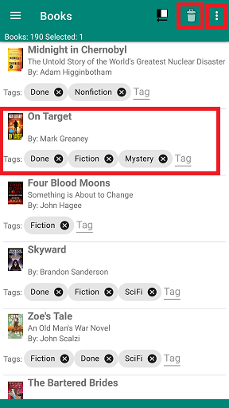

- Touch a book entry to open or close more details
- Touch the book icon to select or deselect a book in the list. The icon for selected books is replaced by a star.
- Touch in the **Tags** field to add or remove a tag for the book. You are only allowed to add existing tags. See [Managing Tags](tags.html) to learn how to add tags to BiblioTech. *Note:* If you remove a tag used to select the book in the current filter, the book will be removed from the display. It is still in you book list.

     

- Press the **Trash Can** icon in the toolbar to delete the selected books. Selected books that are not selected by the current filter are not deleted.
- Other actions are in the **Options Menu**
  - Undo: the last thing you did
  - Redo: Redo the last undo
  - Select All: Select all books in the list. Books that aren't selected by the current filter are not selected.
  - Select None: Deselect all books in the list. Books that aren't selected by the current filter are not deselected.
  - Swap Selection: Deselect all selected books and select all unselected books. The selection of books that aren't selected by the current filter is not changed.
  - Print: Print you book list
  - Settings: Changed settings for BiblioTech
