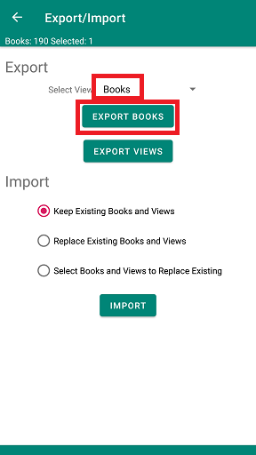
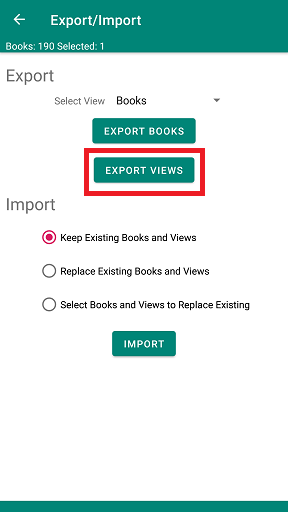
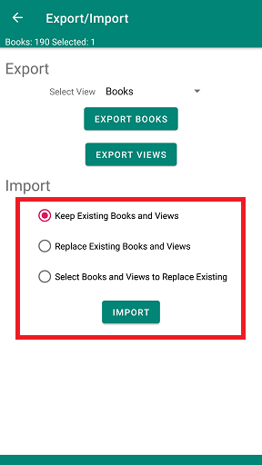

Export and import use a comma-separated-values (CSV) file to hold the data exported and imported. The first line of the file contains information about the data and is used to decide what is being imported. If you want you can open the file in a spreadsheet.

<li>Export Books</li>

- Chose the filter to select the books to be exported. **\*\* All Books \*\*** will export all books in your book list. The last filter you were displaying in the book list is chosen by default.
- Press the **Export Books** button

     

<li>Export Views</li>

- Press the **Export Views** button

     

<li>Import books or views</li>

- Chose how BiblioTech should handle imported books or views that match books or views you already have.
  - Keep Existing Books and Views: Ignore the imported books and views that match
  - Replace Existing Books and Views: Replace you existing books and views with the books and views you import
  - Select Books and Views to Replace Existing: A dialog is used to select the matching books you want to take from the imported file.

     

