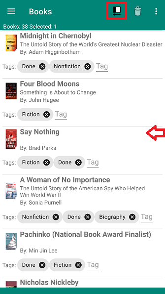
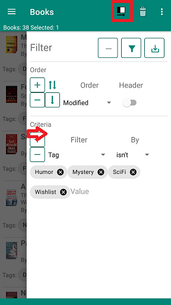
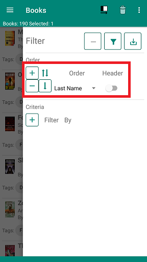
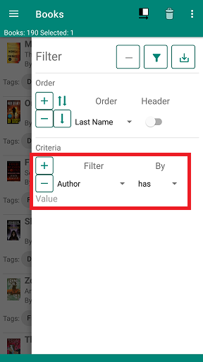

Filters are used to change the list of books currently displayed. You can change the order of the list and you can select which books are displayed in the list.

<li>Opening and closing the filter pane</li>

- Filter settings are in a pane on the right side of the display.
- You can open the pane by swiping left on the right side of the display or touching the right side pane button in the toolbar

     

- You can cllose the pane by touching the right side pane button or swiping the pane off the right side of the display

     

<li>Add, remove and save filters</li>

-  
Remove the current filter from the navigation pane

-  
Add a new filter to the navigation pane

-  
Save the current filter settings and update the display. This button also closes the filter pane.

<li>Change the list order</li>

- Touch the *+* button in the **Order** section of the pane.
- Touch the direction button to change from ascending to descending order
- Select the property you want to use for ordering
  - Last Name: Order by author's last name then first name
  - First Name: Order by the author's first name then last name
  - Title: Order by the book title
  - Category: Order by the book category
  - Tag: Order by the book tag
  - Added: Order by the date the book was added to your book list
  - Modified: Order by the date the booko was last modified in your book list

- Touch the header switch to insert a header when the sort property changes in the list.

     

- You can order by multiple properties. Use the **+** button to add additional properties
- Remove order properties using the **-** button on the row for the property you want to remove
- A book can have multiple values for **Last Name**, **First Name**, **Category** and **Tag**. If you order by these properties the book will appear in the list for each value of property.

<li>Select books to include</li>

- Add a selection criteria by touching the **+** button in the **Filter Criteria** section of the pane
- Select the property you want to use for selcting books
  - Any: Any property of the book
  - Author: The authors first name then last name.
  - Category: The book's category
  - Date Added: The date the book was added to your list
  - Date Modified: The last date the book was modified in yout list
  - Description: The book's description
  - ISBN: The book's ISBN(s)
  - Pages: The book's page count
  - Rating: The book's rating - a number from 1.0 to 5.0
  - Source: The source of the book - usually books.google.com
  - Subtitle: The book's subtitle
  - Tag: The book's tags
  - Title: The book's title
  - Volume: The ID of the book from the book's source

- Select the way values are matched to the property
  - has: Selects a book when any of the values is contained in any of the book property values
  - is: Selects a book when any of the values is equal to any of the book property values
  - hasn't: Selects a book when none of the values is contained in any of the book property values
  - isn't: Selects a book when none of the values is equal to any of the book property values
  - \>: Selects a book when the book property value is greater than any of the values
  - \>=: Selects a book when the book property value is greater than or equal to any of the values
  - \<: Selects a book when the book property value is less than any of the values
  - \<=: Selects a book when the book property value is less than or equal to any of the values

- Add the values used to select the books. Multiple values can be used.

     

- Use the **+** button to add multiple criteria. All of the criteria need to be met to select a book.
- Use the **-** button to remove a criterium

