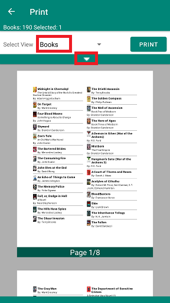
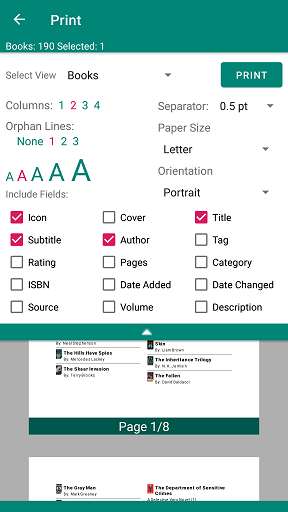
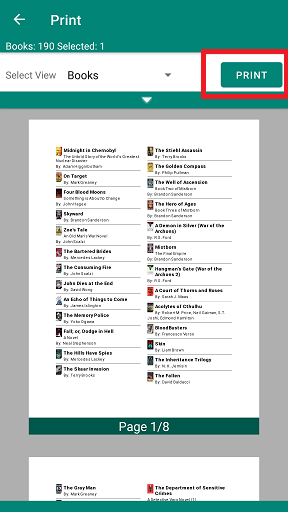

Printing the book is organized in two steps.

- First you decide how the printout is formatted. You can choose the number of columns, the text size and which properties you want to include in the printout. The layout is chosen based on the width of a column in the printout.
- Then you use the system print service to print the list or save it to a PDF

<li>Select the books to be printer</li>

- Chose the filter to select the books to be printed. **\*\* All Books \*\*** will print all books in your book list unordered. The last filter you were displaying in the book list is chosen by default.
- Open the formatting settings to change the format of the printout

     

<li>Format the printout</li>

- Set the number of columns
- Set the orphan lines. This field sets the number of lines BiblioTech treats as orphan lines.
- Set the text size
- Set the width of the separator line between books. **None** will remove the separator line.
- Set the paper size. This value is forwarded to the system print service, and is mainly used to properly show the preview.
- Set the paper orientation. This value is forwarded to the system print service, and is mainly used to properly show the preview.

     

<li>Start the system print service</li>

- Use the **Print** button to start the system print service.
- You can change the paper size and orientation in the system print service from what you selected in the print format.

    

