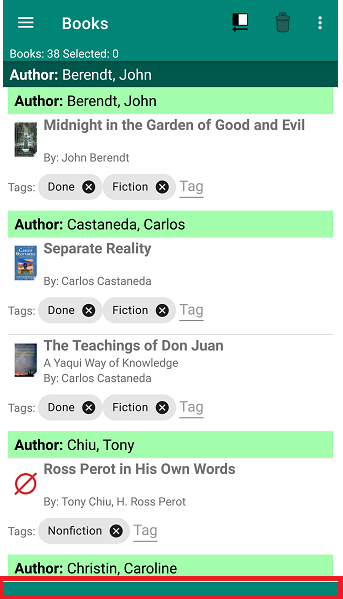
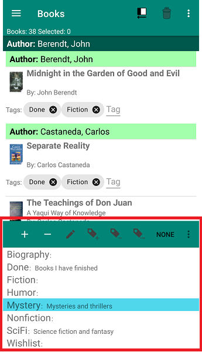

Tags are the main organizing method used by BiblioTech. You create tags and assign them to books to identify which groups each book belongs to. Then you  use filtering to display specific groups.

<li>The tags are managed using a slide-up panel from the botton of the display</li>

- Touch the green band at the bottom of the display and slide your finger toward the top of the display

     

- Touch inside the tags windows and slide your finger down to close the slide-up

     

### Tags Toolbar Actions

-  Add a new tag

-  Delete selected tags

-  Edit the tag name or description. If you rename a tag the same as another existing tag, you will be asked whether BiblioTech should merge the books tagged with the two entries.

-  Add the selected tags to the selected books

-  Remove the selected tags from the selected books

-  Set the tags for the selected books to be selected tags

-  Deselect all tags

-  Open the tags menu. This menu contains:
  - **Select All** Select all tags
  - **Swap Selection** Deselect the selected tags and select the unselected tags

- Touch a tag entry to select or deselect a single tag
