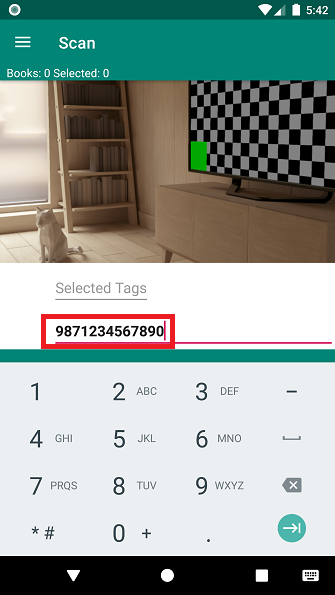

# Adding books

Books are added to the book list using the Scan activity. You can navigate to the Scan activity using the navigation menu:

Opening the Scan Activity

- Open the navigation menu

     

- Select **Scan**

     

Setting tags for the added book(s)

- Tags are assigned when you add a book. You can touch in the **Selected Tags** field to add and remove tags for the next book added. You are only allowed to add existing tags. See [Managing Tags](tags.html) to learn how to add tags to BiblioTech.

     

Scanning the books ISBN barcode

- BiblioTech scans barcodes using the phone camera. It will ask you for permission to use the camera. If you don't grant permission, you won't be able to scan barcodes. You can still add books manually by [entering the ISBN](#manual-isbn) or [entering the author and/or title](#manual-author-title).
- Position the phone so the book's barcode is visible on the display
- Press either the up or down volume button
- When the barcode is read, it will be displyed on the **ISBN** line
- When the book is looked up, the title and author(s) will appear on the **Title** and **Authors** line

Entering the ISBN number

- Touch the **ISBN** line and enter the number without dashes or spaces. If the ISBN number has an **X** as the last digit, enter an **\***. Make sure the **Author** and **Title** lines are empty.

     

- Press the search button

     
     
- When the book is looked up, the title and author(s) will appear on the **Title** and **Authors** line

Searching for the books title and/or author

- If an error occurs, a popup will let you know.
- Some barcodes on books are UPC barcodes and BiblioTech can't look those up. The ISBN number is usually printed along with the barcode. Match the barcode number with the ISBN number to scan the correct barcode. If there isn't an ISBN barcode [you can enter it manually](#manual-isbn).
- If the book cannot be found by ISBN, you can [search for the book using the title and/or author](#manual-author-title).
- Once the book is found, it will be selected when adding it to your book list. You can [change the tags](tags.html), if you forgot to set them correctly before scanning (something I do quite frequently).
